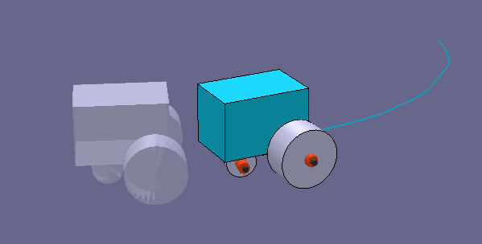

# Robotics Basics In CoppeliaSim
## This rep is for those who want to learn robotics basics.
Repository is showing each algorithm separately and then combined
in 1 class for different types of locomotion systems. These classes
are adding simplicity for more complex robotic problems.

## Implemented algorithms
- Drive to point


- Drive to line


- Drive along path


- Drive to configuration



## Installation
Because robots are expensive we will use free simulator CoppeliaSim. 👍

Installation is possible from official website: https://www.coppeliarobotics.com/downloads (Educational version)


Clone the repository with
```
git clone https://github.com/CukeManCZ/Robotics_Basics_In_CoppeliaSim.git
```
or you can download directly.

Then use Python pip directly or use your preferred package manager to install **coppeliasim-zmqremoteapi-client.**
```
python3 -m pip install coppeliasim-zmqremoteapi-client
```

If you have any problem with installation you can create Issue and I will try to help you as soon as I can.
